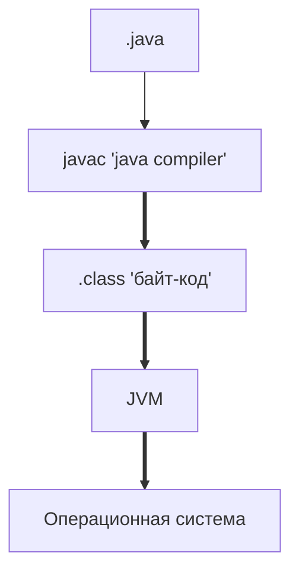

# Описание строк кода со строны JVM

Пример кода:  

```java
    public class JvmComprehension {
    
    public static void main(String[] args) {
        int i = 1;                      // 1
        Object o = new Object();        // 2
        Integer ii = 2;                 // 3
        printAll(o, i, ii);             // 4
        System.out.println("finished"); // 7
    }

    private static void printAll(Object o, int i, Integer ii) {
        Integer uselessVar = 700;                   // 5
        System.out.println(o.toString() + i + ii);  // 6
    }
    }
```



При запуске JVM происходит загрузка файлов Java в область памяти для 
дальнейшего его использования. Подается сигнал в ClassLoader который получает строку 
по которой можно распознать файл. По умолчанию сть 3 ClassLoader: 
1. Application ClassLoader
2. Platform ClassLoader
3. Bootstrap ClassLoader
  
Разбираемся по строкам пример который указан выше.
1. Подгружается класс в ClassLoader, далее выделяестя память в 
Metaspace (можно задать параметрами MetaspaceSize=N, MaxMetespace=N, по умолчанию размер не ограничен)
2. В момент вызова метода создается фрейм(кадр) в стеке
3. Метод main создает область в стеке (фрем в котором хранится все что происходит в текущем методе)
4. 1 строка ***"int i = 1;"*** занесение данных в Stack Memory.
5. 2 Строка выделение(резервирование) в куче(heap) места под объект. Далее
передается ссылка переменной "о" и занесении ее в стек.
6. 3 Строка ***"Integer ii = 2;"*** занесение данных в Stack Memory.
7. 4 Строка В момент вызова метода создается фрем в стеке.
8. 5 Строка ***"Integer uselessVar = 700;"*** занесение данных в Stack Memory.
9. 6 Строка создание нового фрейма в стеке куда передастся значение переменных.
10. 7 Строка создание нового фрейма в стеке куда будет передано значение переменной.


